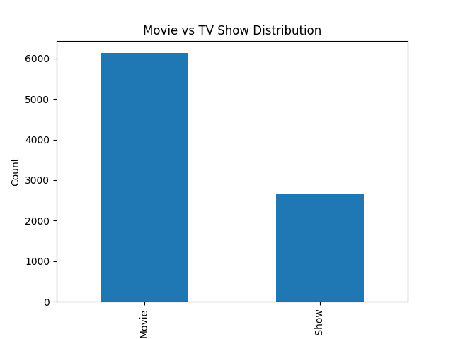
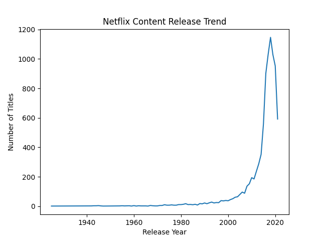
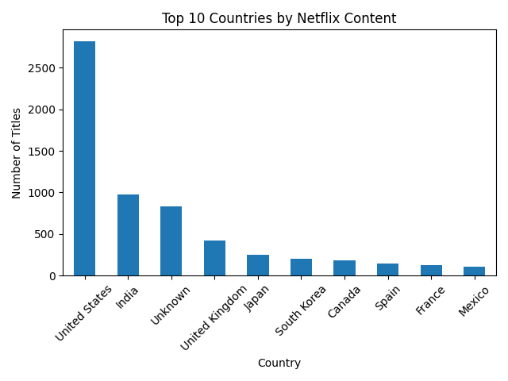
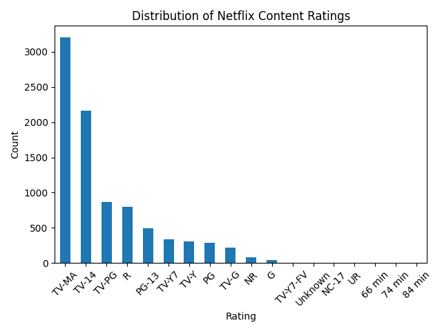
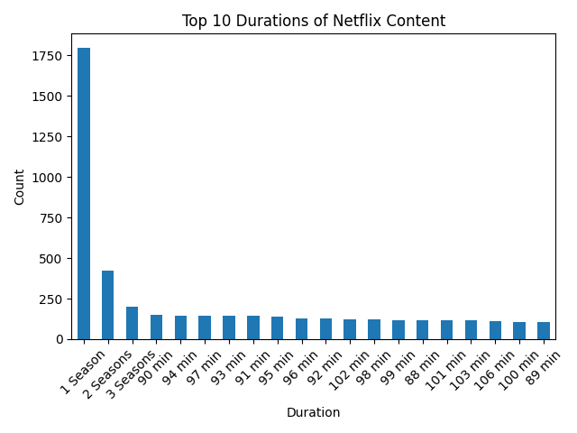

# Netflix Dataset Cleaning and Exploratory Data Analysis

## About the Project

This project focuses on understanding, cleaning, and analyzing the **Netflix Titles dataset** using Python. The objective is to explore how real-world datasets are inspected, cleaned, and analyzed before applying machine learning techniques.

The project demonstrates the early stages of a typical data science workflow, including dataset inspection, data cleaning, exploratory data analysis (EDA), and visualization of important patterns within the data.

The goal is to build a strong foundation in working with structured datasets and understanding how proper data preparation supports future analytical and machine learning tasks.

---

## Dataset

**Dataset Used:** Netflix Titles Dataset

The dataset contains information about movies and TV shows available on Netflix.

Each row represents a single Netflix title (movie or TV show).

Dataset structure:

- Rows: **8807**
- Columns: **12**

### Sample Dataset Rows

| show_id | type | title | director | country | release_year | rating | duration |
|--------|------|------|----------|---------|--------------|--------|----------|
| s1 | Movie | Dick Johnson Is Dead | Kirsten Johnson | United States | 2020 | PG-13 | 90 min |
| s2 | TV Show | Blood & Water | Unknown | South Africa | 2021 | TV-MA | 2 Seasons |

### Column Overview

| Column | Description |
|------|-------------|
| show_id | Unique identifier for each title |
| type | Indicates whether the title is a Movie or TV Show |
| title | Name of the movie or show |
| director | Director of the title |
| cast | Main actors appearing in the title |
| country | Country of production |
| date_added | Date when the title was added to Netflix |
| release_year | Year the title was released |
| rating | Audience rating classification |
| duration | Length of movie or number of seasons |
| listed_in | Genre or category of the title |
| description | Short description of the content |

The dataset contains several rating categories including **TV-MA, TV-14, TV-PG, PG-13, and R**, indicating the intended audience for each title.

---

## Project Workflow

The project follows a structured data analysis workflow:

```
Load Dataset
↓
Dataset Understanding
↓
Basic Data Checks
↓
Data Cleaning (handling missing values and duplicates)
↓
Save Cleaned Dataset
↓
Statistical Summary
↓
Exploratory Data Analysis
↓
Visualization and Insights
```

This pipeline converts raw data into a clean dataset suitable for analysis.

---

## Data Cleaning

Before performing analysis, the dataset was inspected and cleaned to ensure data quality.

Cleaning steps included:

- Inspecting dataset structure using `df.info()`
- Reviewing sample records using `df.head()`
- Identifying missing values
- Filling missing categorical values with `"Unknown"`
- Checking for duplicate records
- Verifying dataset consistency after cleaning

Example cleaning operation:

```python
df[col] = df[col].fillna("Unknown")
```

After cleaning, the dataset was verified to confirm that no missing values or duplicate rows remained.

---

## Exploratory Data Analysis (EDA)

Exploratory Data Analysis was performed to understand the distribution and characteristics of the dataset.

Key columns explored during analysis:

- **type**
- **release_year**
- **country**
- **rating**
- **duration**

Example command used during analysis:

```python
df['type'].value_counts()
```

EDA helps identify patterns, trends, and relationships within the dataset.

---

## Insights

### Content Type Distribution



Movies dominate the Netflix catalog, significantly outnumbering TV Shows in the dataset.

---

### Release Year Trend



The number of titles increases significantly after approximately **2015**, reflecting the expansion of streaming platforms and original content production.

---

### Country Distribution



The **United States** produces the largest share of Netflix titles, followed by **India** and the **United Kingdom**, indicating strong contributions from both Western and international markets.

---

### Rating Distribution



Most titles fall under **TV-MA** and **TV-14**, suggesting that the majority of Netflix content targets **adult and teen audiences**.

---

### Duration Distribution



Many TV shows in the dataset have **only one season**, while movies typically range between **90 and 110 minutes** in length.

---

## Machine Learning Perspective

Although this project does not implement machine learning models, the dataset could support several potential ML tasks such as:

- Predicting whether a title is a **Movie or TV Show**
- Predicting the **content rating**
- Genre classification using the **description** field

Before applying machine learning algorithms, additional preprocessing and feature engineering would be required to convert categorical and text data into numerical features.

---

## Tools Used

The following tools and technologies were used in this project:

- Python
- pandas
- matplotlib
- Git
- GitHub

---

## Learning Outcomes

Through this project, the following skills were developed:

- Understanding and inspecting real-world datasets
- Data cleaning and preprocessing
- Exploratory data analysis
- Data visualization
- Organizing a structured data project
- Version control using Git

---

## Future Work

This dataset provides opportunities for further exploration, including:

- Advanced data analysis and trend exploration
- Feature engineering for machine learning
- Text analysis using the **description** column
- Building predictive models using the cleaned dataset

Future projects will expand on these possibilities by applying machine learning and more advanced analytical techniques.